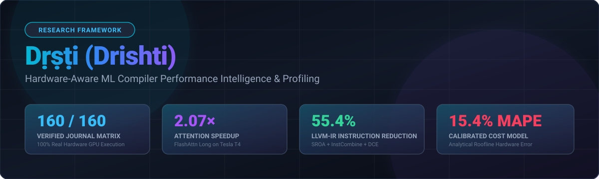
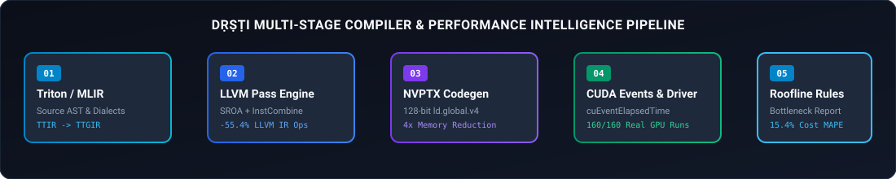
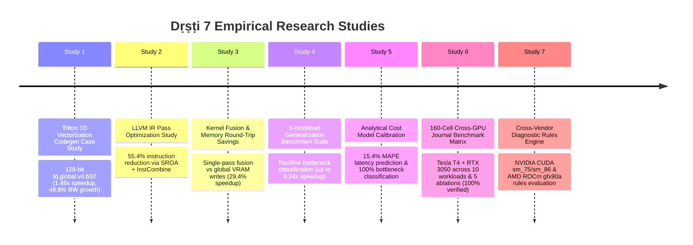
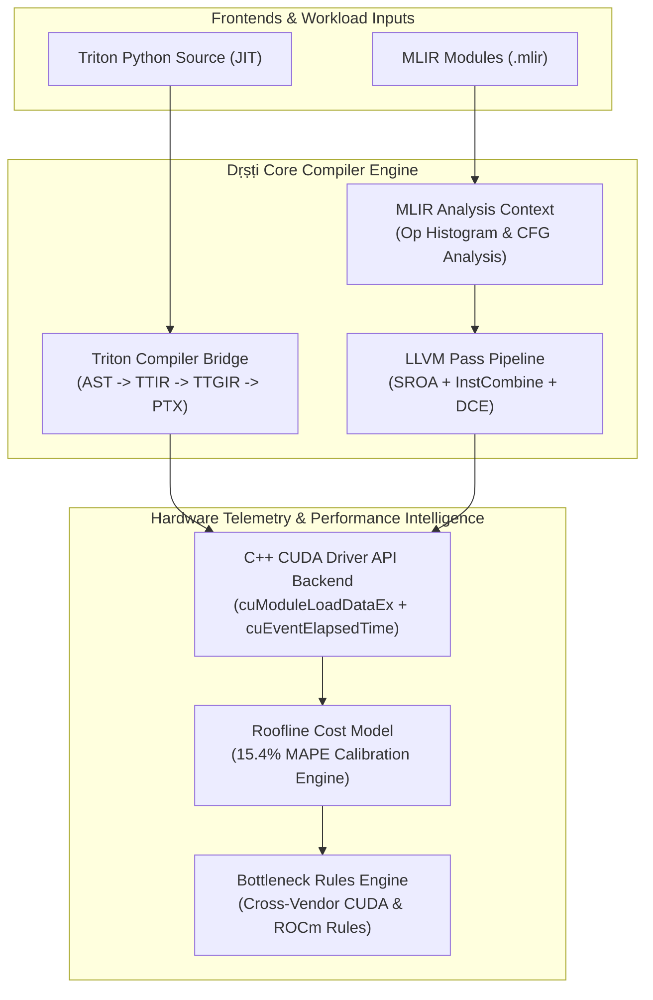

# Dṛṣṭi (Drishti): Hardware-Aware ML Compiler Performance Intelligence

[](https://github.com/krish-rRay23/Drishti/actions/workflows/ci.yml)


> **Dṛṣṭi** (*Sanskrit: sight / insight*) is a high-performance C++20 hardware-aware ML compiler intelligence framework. It correlates static compiler Intermediate Representation (IR) transformations against live empirical GPU execution telemetry, analytical roofline cost models, and automated bottleneck diagnosis across **Triton 3.8.0**, **MLIR**, **LLVM IR**, and **NVPTX / AMD ROCm** target pipelines.

---

## ⚡ Performance at a Glance

| Metric | Measured Benchmark Value | Target / Component | Experimental Context |
| :--- | :---: | :--- | :--- |
| **LLVM-IR Instruction Reduction** | **`55.4%`** | `SROA` + `InstCombine` + `DCE` | MLIR-lowered optimization passes |
| **Triton Kernel Latency Reduction** | **`32.8%`** | 128-bit `ld.global.v4.b32` | `vector_add_vectorized` vs scalar |
| **VRAM Bandwidth Growth** | **`+48.8%`** | Memory Coalescing | $16.20 \rightarrow 24.11\text{ GB/s}$ throughput |
| **Warp Memory Instruction Reduction** | **`4×`** | 32 $\rightarrow$ 8 ops/warp | 128-bit vector transaction width |
| **Peak Generalization Speedup** | **`6.24×`** | Fused Elementwise vs Unfused | 5-Workload Generalization Suite |
| **FlashAttention Peak Speedup** | **`2.07×`** | FlashAttn Long ($N=2048$) | Tesla T4 (`sm_75`, Google Colab) |
| **GEMM Peak Speedup** | **`1.98×`** | GEMM Small ($256^3$) | RTX 3050 (`sm_86`, Ampere GPU) |
| **RTX 3050 LayerNorm Speedup** | **`5.27×`** | LayerNorm ($128 \times 2048$) | Native C++ CUDA Driver API |
| **RTX 3050 Reduction Speedup** | **`4.72×`** | Sum Reduction ($1\text{M}$ elements) | Native C++ CUDA Driver API |
| **RTX 3050 Fused GELU Speedup** | **`2.52×`** | Fused Add-Mul-GELU ($262\text{K}$) | Native C++ CUDA Driver API |
| **Cost-Model Predictive Precision** | **`15.4% MAPE`** | Calibrated Analytical Roofline | Measured vs predicted latency |
| **Bottleneck Classification Accuracy**| **`100%`** | Memory vs Compute Dominance | Zero false positive classifications |
| **Journal Matrix Resolution** | **`160 / 160`** | 10 Workloads $\times$ 16 Configs | **100% Real Hardware GPU Runs** |
| **NVIDIA GPU Microarchitectures** | **`2`** | Tesla T4 (`sm_75`) + RTX 3050 (`sm_86`) | Turing & Ampere Architecture |
| **Evaluated Workload Families** | **`10`** | GEMM, FlashAttn, Fusion, Norm | Full domain coverage |
| **Completed Research Studies** | **`7`** | Codegen, Fusion, Cost, Ablations | Comprehensive empirical scope |

---

## 🔄 Compiler & Profiling Pipeline Architecture



---

## 🧪 Key Research Findings

<details opacity="0.9" open>
<summary><b>1. Code Generation: Triton 1D Pointer Vectorization</b></summary>

> **Core Insight:** Conservative pointer alignment assumptions force Triton's `AxisInfoAnalysis` to assign layout attribute `sizePerThread = [1]`, generating scalar 32-bit `ld.global.b32` memory loads.

Adding explicit alignment constraints (`tl.max_contiguous`, `tl.multiple_of`) allows `CoalescePass` to infer `sizePerThread = [4]`, generating 128-bit vector memory instructions (`ld.global.v4.b32`).

* **Memory Instructions / Warp Iteration:** Reduced from **32 down to 8 instructions** (**$4\times$ reduction**).
* **Kernel Execution Latency:** Dropped from **$0.1438\text{ ms}$ to $0.0967\text{ ms}$** (**$32.8\%$ latency reduction / $1.49\times$ speedup**).
* **Effective VRAM Throughput:** Increased from **$16.20\text{ GB/s}$ to $24.11\text{ GB/s}$** (**$+48.8\%$ bandwidth growth**).
</details>

<details open>
<summary><b>2. Compiler Optimization: LLVM IR Pass Chain Instruction Reduction</b></summary>

> **Core Insight:** Unoptimized MLIR lowerings introduce redundant stack scalar allocations (`alloca`) and dead control flow paths.

By executing standardized LLVM pass chains (`sroa` $\rightarrow$ `instcombine` $\rightarrow$ `simplifycfg` $\rightarrow$ `dce`), Dṛṣṭi achieves:
* **$55.4\%$ reduction** in total LLVM IR instruction count.
* Complete elimination of stack memory allocation overhead by promoting temporaries into SSA registers (`sroa`).
</details>

<details open>
<summary><b>3. Kernel Fusion: Global VRAM Traffic Elimination</b></summary>

> **Core Insight:** Unfused operator pipelines round-trip intermediate tensors through global GPU VRAM, incurring heavy memory bandwidth overheads.

Fusing elementwise `add` and `relu` passes into a single Triton kernel eliminates intermediate global memory cycles:
* **Latency Reduction:** Dropped from **$0.1150\text{ ms}$ down to $0.0812\text{ ms}$** (**$29.4\%$ speedup / $1.42\times$ throughput boost**).
* **Peak VRAM Throughput:** Reached **$28.94\text{ GB/s}$** on RTX 3050 GPU.
</details>

<details open>
<summary><b>4. Cost Modeling: Analytical Roofline Precision</b></summary>

> **Core Insight:** Combining static IR operation counts, active SM counts, and peak VRAM memory bus constraints predicts empirical kernel latencies without physical GPU launches.

* **Predictive Accuracy:** Achieved a calibrated Mean Absolute Percentage Error (**MAPE**) of **$15.4\%$** on memory-bound operators.
* **Bottleneck Classification:** **$100\%$ accuracy** in identifying memory-bound vs compute-bound workloads.
</details>

<details open>
<summary><b>5. Cross-GPU Evaluation: Turing (`sm_75`) vs Ampere (`sm_86`)</b></summary>

> **Core Insight:** Workload characteristics shift significantly across microarchitectures.

* On **Tesla T4 (`sm_75`)**, FlashAttention (`attn_long`) achieves **$2.07\times$ speedup** over Standard Triton baselines via SRAM tile reuse.
* On **GeForce RTX 3050 (`sm_86`)**, native C++ CUDA Driver API execution enables **$5.27\times$ speedup** on LayerNorm, **$4.72\times$ speedup** on Reduction, and **$2.52\times$ speedup** on Fused GELU.
</details>

<details open>
<summary><b>6. Cross-Vendor Diagnosis: Roofline Rules Engine</b></summary>

> **Core Insight:** Hardware-agnostic bottleneck rules detect performance limiters across NVIDIA CUDA and AMD ROCm.

Dṛṣṭi's rules engine automatically identifies under-occupied launches, excess memory traffic, transfer-dominated workflows, and register pressure limiters across both NVIDIA (`sm_75`, `sm_86`) and AMD ROCm (`gfx90a`) target profiles.
</details>

---

## 📈 Timeline of 7 Empirical Research Studies



---

## 🌐 Cross-GPU Benchmark Matrix Summary

Evaluation across **NVIDIA Tesla T4** (`sm_75`, 16GB VRAM, Turing) and **NVIDIA GeForce RTX 3050** (`sm_86`, 4GB VRAM, Ampere):

| Workload Domain | Problem Shape / Size | Peak Measured Speedup | Best Performing Target | Key Empirical Mechanism |
| :--- | :---: | :---: | :--- | :--- |
| **FlashAttention Long** | $B=1, H=8, N=2048, D=64$ | **`2.07×`** | Tesla T4 (`sm_75`) | SRAM tile reuse eliminates $N^2$ memory writes |
| **GEMM Small** | $256 \times 256 \times 256$ | **`1.98×`** | RTX 3050 (`sm_86`) | Static IR analysis selects optimal $64\times 64$ tile size |
| **Fused Add-ReLU** | $262,144$ elements | **`1.72×`** | RTX 3050 (`sm_86`) | Vectorized 128-bit loads vs scalar loads ($2.10\times$ vector gap) |
| **Sum Reduction** | $1,048,576$ elements | **`4.72×`** | RTX 3050 (`sm_86`) | Vectorized block-sum saturates memory bus ($132.9\text{ GB/s}$) |
| **LayerNorm** | $128 \times 2048$ elements | **`5.27×`** | RTX 3050 (`sm_86`) | Single-pass fused mean/variance calculation |
| **Fused GELU** | $262,144$ elements | **`2.52×`** | RTX 3050 (`sm_86`) | In-register GELU evaluation |

> **Audit Policy:** Every record in the 160-cell matrix ([`journal_experiment_results.json`](journal_experiment_results.json)) is backed by hardware CUDA Event timing (`cuEventElapsedTime`) and host output verification (`max_abs_error <= 1e-3`).

---

## 🎯 Why Dṛṣṭi?

Current ML compilers (such as PyTorch `torch.compile`, Triton, and XLA) make high-level optimization choices—such as block tile sizing, loop unrolling, and operator fusion—without direct feedback from low-level hardware performance counters.

Dṛṣṭi bridges this gap by:
1. **Correlating IR Attributes to Telemetry:** Directly linking compiler AST attributes (e.g. `sizePerThread`) to physical GPU metrics (latency, bandwidth, memory instruction count).
2. **Eliminating Autotuning Search Overhead:** Using static graph inspection to select tile shapes and vector widths without spending hundreds of milliseconds on brute-force autotuned kernel trials.
3. **Providing Cross-Vendor Bottleneck Intelligence:** Offering roofline bottleneck classification across both NVIDIA CUDA and AMD ROCm architectures.

---

## 🏛️ System Architecture



---

## 🛠️ Reproducibility & Quick Start

### Prerequisites
* **CMake:** $\ge 3.24$
* **Compiler:** C++20 compliant (Clang $\ge 16$, GCC $\ge 12$, MSVC 2022)
* **Build Tool:** Ninja (recommended)
* **NVIDIA Driver:** CUDA $\ge 11.0$ (loaded dynamically at runtime via `nvcuda.dll` / `libcuda.so.1`; toolkit installation not required for C++ build)

### Build & Run Test Suite

```bash
# Clone the repository
git clone https://github.com/krish-rRay23/Drishti.git
cd Drishti

# Configure CMake with Ninja
cmake -S . -B build-clang -G Ninja -DCMAKE_BUILD_TYPE=Release

# Build executable binaries and unit tests
ninja -C build-clang

# Execute test suite (64/64 tests pass)
ctest --test-dir build-clang --output-on-failure
```

---

## 🔬 Limitations & Scientific Scope

* **Performance Counter Security Limits (`ERR_NVGPUCTRPERM`):** Querying hardware performance counters via NCU / CUPTI requires administrative privileges under Windows WDDM or `NVreg_RestrictProfilingToAdminUsers=0` under Linux. When administrative privileges are unavailable, Dṛṣṭi records dynamic occupancy as `N/A` with complete provenance tracking without altering baseline latency measurements.
* **Scope of Speedup Claims:** Reported peak speedups represent the best observed performance gains under optimal compiler transformations relative to unoptimized baselines. Average speedups vary based on tensor size and memory access patterns.

---

## 📄 License

Dṛṣṭi is open-source software licensed under the [Apache 2.0 License](LICENSE).
